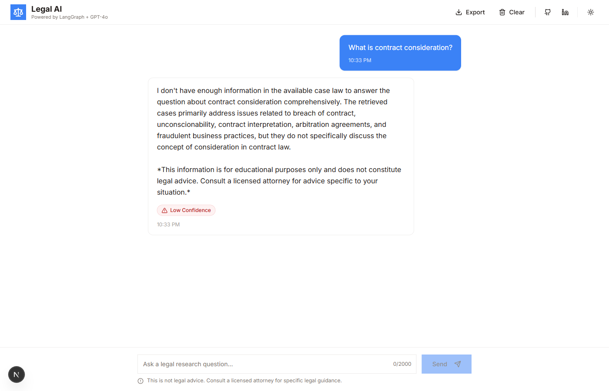
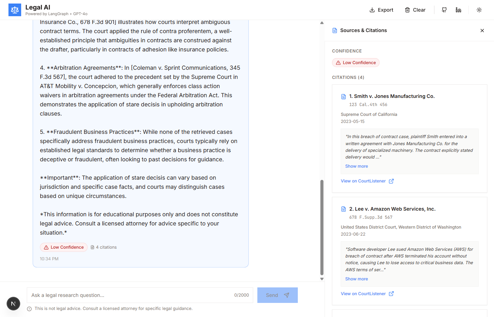

# Legal AI Research Assistant

A RAG-powered legal research assistant that answers questions about U.S. case law with citation-grounded responses, dual-layer confidence scoring, and a modern chat interface.

**Built with:** FastAPI + LangGraph | Next.js 16 + TypeScript | Pinecone + OpenAI | Shadcn/ui + Tailwind CSS

[LinkedIn](https://www.linkedin.com/in/p-tendulkar/) | [GitHub](https://github.com/pradyten/legal-ai)

---

## Screenshots

### Chat Response with RAG Pipeline

*AI-generated answer with typewriter effect, confidence badge, and citation count. The header includes export, clear chat, GitHub/LinkedIn links, and theme toggle.*

### Source Drawer with Citations

*Slide-out drawer showing confidence scoring, 4 cited cases with court details and excerpts, and 5 retrieved source chunks with match percentages.*

---

## Features

- **RAG Pipeline Visualization** — 5-step animated pipeline stepper (Rewrite → Retrieve → Assess → Generate → Score) shows the AI's reasoning process in real-time
- **Dual Confidence Scoring** — combines retrieval quality (60%) with LLM self-assessment (40%); hover the badge for a detailed breakdown with progress bars
- **Citation-Grounded Answers** — every response includes verifiable case citations with court, date, and expandable excerpts
- **Typewriter Animation** — answers stream character-by-character for the latest message; respects `prefers-reduced-motion`
- **Slide-Out Source Drawer** — click any assistant message to open an inline drawer with citations and retrieved chunks; chat area resizes naturally
- **Dark/Light Theme** — system-aware theme toggle with smooth transitions
- **Export Chat** — download conversation as TXT or JSON
- **Copy Messages** — one-click copy for any message
- **Example Questions** — clickable starter prompts on the empty state
- **Error Handling** — error boundary, toast notifications, and graceful API failure recovery

## Architecture

```
┌─────────────────────────────────────────────────────┐
│                    Frontend (Next.js 16)             │
│  ┌──────────────────────┐  ┌──────────────────────┐ │
│  │      Chat Area       │  │   Source Drawer       │ │
│  │  - Message bubbles   │  │  - Confidence score   │ │
│  │  - Typewriter effect │◄─│  - Citations          │ │
│  │  - Pipeline stepper  │  │  - Retrieved chunks   │ │
│  │  - Input bar         │  │  - Match percentages  │ │
│  └──────────┬───────────┘  └──────────────────────┘ │
└─────────────┼───────────────────────────────────────┘
              │ POST /chat
              ▼
┌─────────────────────────────────────────────────────┐
│              Backend (FastAPI + LangGraph)           │
│                                                     │
│  ┌─────────┐  ┌──────────┐  ┌────────┐  ┌────────┐│
│  │Rewrite  │─▶│ Retrieve │─▶│ Assess │─▶│Generate││
│  │Question │  │  (top-5) │  │Retrieval│  │ Answer ││
│  └─────────┘  └──────────┘  └────────┘  └────────┘│
│                                              │      │
│                              ┌────────┐  ┌───▼────┐│
│                              │Combine │◄─│  Self  ││
│                              │& Score │  │ Assess ││
│                              └────────┘  └────────┘│
│                                                     │
│  Pinecone (vectors) ◄──── text-embedding-3-small    │
│  GPT-4o (primary)   ◄──── Mistral (fallback)       │
└─────────────────────────────────────────────────────┘
```

### RAG Pipeline (6 Nodes)

| Node | Purpose |
|------|---------|
| **Rewrite Question** | Reformulates follow-up questions as standalone queries using conversation context |
| **Retrieve Documents** | Pinecone vector search — top-5 chunks using `text-embedding-3-small` (1536d) |
| **Assess Retrieval** | Evaluates retrieval quality from similarity scores |
| **Generate Answer** | GPT-4o generates citation-grounded answer (Mistral fallback) |
| **Self-Assess LLM** | LLM evaluates its own answer confidence |
| **Combine & Score** | Weighted confidence: 60% retrieval + 40% LLM self-assessment |

### Confidence Levels

| Level | Score | Color |
|-------|-------|-------|
| High | >= 0.75 | Green |
| Medium | >= 0.50 | Amber |
| Low | >= 0.25 | Red |
| Insufficient | < 0.25 | Gray |

## Tech Stack

### Backend
- **FastAPI** — async Python web framework
- **LangGraph** — composable multi-step RAG workflow
- **OpenAI GPT-4o** — primary LLM with Mistral fallback
- **Pinecone** — vector database (free tier, ~150 vectors)
- **text-embedding-3-small** — 1536-dimension embeddings

### Frontend
- **Next.js 16** — App Router with TypeScript strict mode
- **Shadcn/ui** — Radix UI primitives (Dialog, Popover, DropdownMenu, ScrollArea)
- **Tailwind CSS v3** — HSL CSS variables for light/dark theming
- **Lucide React** — icon library
- **Sonner** — toast notifications

## Getting Started

### Prerequisites
- Python 3.11+
- Node.js 18+
- OpenAI API key
- Pinecone API key (free tier)
- Optional: Mistral API key (for LLM fallback)

### 1. Clone the repository
```bash
git clone https://github.com/pradyten/legal-ai.git
cd legal-ai
```

### 2. Backend setup
```bash
# Create and activate virtual environment
python -m venv venv
source venv/Scripts/activate   # Windows Git Bash
# source venv/bin/activate     # macOS/Linux

# Install dependencies
pip install -r backend/requirements.txt

# Configure environment
cp backend/.env.example backend/.env
# Edit backend/.env with your API keys:
#   OPENAI_API_KEY=sk-...
#   PINECONE_API_KEY=...

# Ingest mock case data into Pinecone (~150 vectors from 30 cases)
python -m backend.ingestion.ingest

# Start backend server
python -m uvicorn backend.main:app --reload --host 0.0.0.0 --port 8000
```

### 3. Frontend setup
```bash
cd frontend
npm install

# Configure API URL (optional, defaults to http://localhost:8000)
echo "NEXT_PUBLIC_API_URL=http://localhost:8000" > .env.local

npm run dev
```

### 4. Quick Start (Windows)
```bash
./start-dev.bat
# or
./start-dev.ps1
```

Open [http://localhost:3000](http://localhost:3000) in your browser.

## Project Structure

```
legal-ai/
├── backend/
│   ├── main.py                 # FastAPI app entry point
│   ├── config.py               # Pydantic Settings (env vars)
│   ├── routes/
│   │   └── chat.py             # POST /chat endpoint
│   ├── services/
│   │   ├── rag_pipeline.py     # 6-node LangGraph pipeline
│   │   ├── llm_provider.py     # OpenAI/Mistral LLM abstraction
│   │   ├── retriever.py        # Pinecone vector search
│   │   └── confidence.py       # Dual-layer confidence scoring
│   └── ingestion/
│       ├── ingest.py           # Data loading pipeline
│       └── data/               # 30 synthetic legal cases
├── frontend/
│   ├── app/
│   │   ├── page.tsx            # Main page (state management)
│   │   ├── layout.tsx          # Root layout + providers
│   │   └── globals.css         # Theme tokens + animations
│   ├── components/
│   │   ├── ChatArea.tsx        # Chat interface
│   │   ├── Header.tsx          # App header with actions
│   │   ├── MessageBubble.tsx   # Message cards + typewriter
│   │   ├── SourceDrawer.tsx    # Slide-out citation drawer
│   │   ├── PipelineStepper.tsx # RAG pipeline animation
│   │   ├── ConfidenceBadge.tsx # Score badge + popover
│   │   ├── EmptyState.tsx      # Hero + example questions
│   │   ├── CitationCard.tsx    # Expandable citation card
│   │   └── ui/                 # Shadcn/ui primitives
│   ├── hooks/
│   │   └── useTypewriter.ts    # Typewriter animation hook
│   ├── lib/
│   │   ├── api.ts              # API client
│   │   ├── constants.ts        # App constants
│   │   └── utils.ts            # Utility functions
│   └── types/
│       └── index.ts            # TypeScript interfaces
├── docs/screenshots/           # README screenshots
├── start-dev.bat               # Windows quick start
└── start-dev.ps1               # PowerShell quick start
```

## API

### `POST /chat`

**Request:**
```json
{
  "session_id": "uuid",
  "message": "What is qualified immunity?",
  "conversation_history": [
    { "role": "user", "content": "..." },
    { "role": "assistant", "content": "..." }
  ]
}
```

**Response:**
```json
{
  "answer": "Qualified immunity is...",
  "citations": [
    {
      "case_name": "Smith v. City of Example",
      "citation": "123 F.3d 456",
      "court": "United States Court of Appeals, Ninth Circuit",
      "date": "2023-01-15",
      "relevant_text": "..."
    }
  ],
  "confidence": "high",
  "confidence_score": 0.82,
  "retrieval_confidence": 0.85,
  "llm_confidence": 0.78,
  "retrieved_chunks": [...]
}
```

Interactive API docs available at `http://localhost:8000/docs`.

## Sample Queries

1. **Contract Law**: "What is contract consideration?"
2. **Constitutional Law**: "Explain the Fourth Amendment exclusionary rule"
3. **Civil Rights**: "What is qualified immunity for police officers?"
4. **Legal Doctrine**: "How does the doctrine of stare decisis work?"
5. **Follow-up**: Ask "Can you give me another example?" after any answer

## Cost Estimates

| Resource | Cost |
|----------|------|
| Pinecone | Free (up to 100K vectors, we use ~150) |
| OpenAI Embeddings | ~$0.02 per full ingestion |
| OpenAI GPT-4o | ~$0.015 per query |
| **Monthly (100 queries)** | **~$1.50** |

## License

This project is for educational and portfolio purposes.

---

**Disclaimer**: This tool is for educational and research purposes only. It does not constitute legal advice. Always consult a licensed attorney for legal matters.

Built by [Pradyumn Tendulkar](https://www.linkedin.com/in/p-tendulkar/)
